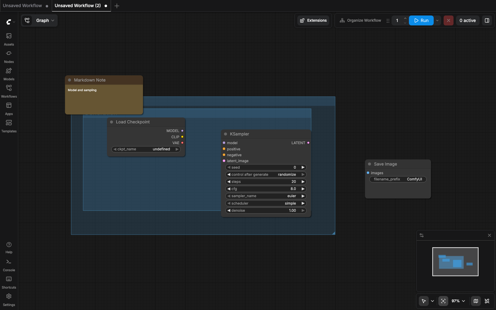
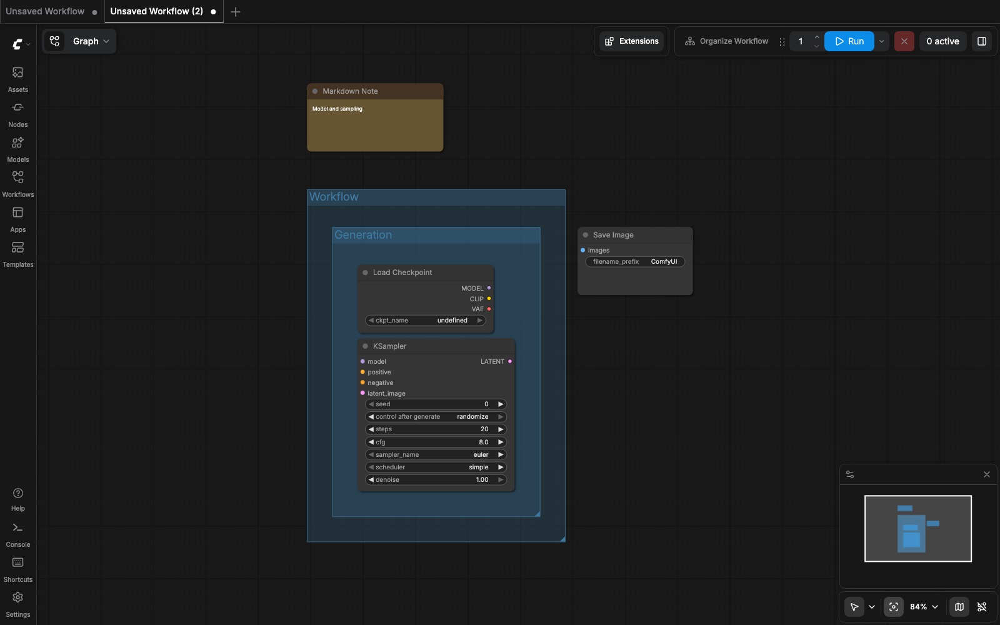

# ComfyUI Workflow Graph Organizer

[](https://github.com/rurusasu/comfyui-workflow-graph-organizer/actions/workflows/ci.yaml)
[](LICENSE)
[](https://github.com/rurusasu/comfyui-workflow-graph-organizer/releases)

Organizes the geometry of a complete ComfyUI workflow graph without changing
execution semantics. Nodes, nested backgrounds, Markdown comments, and
ungrouped nodes are arranged in one native undo transaction. Links, node types,
modes, widget values, and connected inputs are preserved; re-running an already
organized graph is idempotent. This is an independently maintained AGPL-3.0
fork of [ComfyUI Node Organizer](https://github.com/PBandDev/comfyui-node-organizer).

<p align="center">
  
  
</p>

Both images are reproducible captures of the checked-in
[`tests/fixtures/whole-workflow-layout.json`](tests/fixtures/whole-workflow-layout.json)
fixture in this repository's dedicated `.test-comfy` WebUI.

## Features

- Whole-graph layout in one native undo transaction.
- Nested background fitting, root-background packing, comment lanes, and an
  ungrouped-node cluster.
- Finite-geometry, padding, and overlap validation with exact rollback on an
  error.
- **Organize Nodes Only**, selected **Organize Group**, title tokens, and the
  `sugiyama`, horizontal, and vertical algorithms.
- Preserves execution semantics: links, node types, modes, widget values, and
  connected inputs are not changed by organization. Organizing an already
  organized graph is idempotent.

## Examples

The checked-in `whole-workflow-layout` fixture is a generic example with a
nested background, a Markdown comment, and an ungrouped node. The before/after
images above show the same fixture before and after the primary action.

## Comparison

| Capability | This fork | Upstream Node Organizer | Workflow-file/sidebar managers |
| --- | --- | --- | --- |
| Primary scope | Complete graph geometry | Node and group layout | File discovery and management |
| Backgrounds, comments, ungrouped nodes | Normalized together | Not this fork's pipeline | Outside scope |
| Validation and rollback | Yes | Not this fork's additions | Outside scope |
| Relationship | Replacement | Original project | Separate tools |

## Installation

### ComfyUI Manager / Registry

The canonical listing is
[workflow-graph-organizer on Comfy Registry](https://registry.comfy.org/nodes/workflow-graph-organizer).
Search for `workflow-graph-organizer` in ComfyUI Manager, or install the exact
release with Comfy CLI:

```bash
comfy node install workflow-graph-organizer@1.0.1
```

Use Manager's update control for later releases. Restart ComfyUI, hard-refresh
the browser, then open **Settings > Workflow Graph Organizer > About** and
verify the displayed `Version 1.0.1` before removing a recoverable prior
install.

### Manual Git installation

From ComfyUI's `custom_nodes` directory, clone the reviewed GitHub repository
and restart ComfyUI:

```bash
git clone https://github.com/rurusasu/comfyui-workflow-graph-organizer.git workflow-graph-organizer
```

To update, stop ComfyUI, enter that directory, and run:

```bash
git pull --ff-only
```

Restart ComfyUI after updating, hard-refresh the browser, and verify `Version
1.0.1` in **Settings > Workflow Graph Organizer > About**. For a
release-candidate checkout, compare `git rev-parse HEAD` with the commit shown
by the matching GitHub release before updating.

To uninstall, stop ComfyUI, remove the `workflow-graph-organizer` directory
from `custom_nodes` with your file manager, then restart ComfyUI.

## Migration

This extension replaces `comfyui-node-organizer`; it is not an add-on
dependency. Double installation is unsupported: do not install both extensions.

1. Save open workflows.
2. Disable or remove `comfyui-node-organizer`.
3. Install `workflow-graph-organizer`.
4. Restart ComfyUI and confirm **Organize Workflow** appears.
5. Keep a recoverable copy of the original package until verification.

The extension warns when the original organizer is still registered. Verify
the migration by opening **Settings > Workflow Graph Organizer > About**,
confirming `Version 1.0.1`, and running **Organize Workflow** on a saved copy
of a workflow.

## Usage

Run **Organize Workflow** from the action bar, canvas menu,
`Extensions > Workflow Graph Organizer`, or `Shift+O`. Edit the shortcut in
ComfyUI **Settings > Keybinding**. **Organize Nodes Only** keeps the narrower
node-layout action; **Organize Group** works with one or more selected backgrounds/groups.

| Label | Command ID | Scope |
| --- | --- | --- |
| Organize Workflow | `workflow-graph-organizer.organize` | Complete workflow |
| Organize Nodes Only | `workflow-graph-organizer.organize-nodes-only` | Nodes only |
| Organize Group | `workflow-graph-organizer.organize-groups` | Selected backgrounds/groups |

### Results

- **Success:** the node engine changed geometry and complete-workflow
  validation passed.
- **No-op:** the node engine made no observable geometry change; backgrounds
  and comments may still be normalized.
- **Rollback:** an error or validation failure restores the exact original
  geometry before the transaction ends.

### Title tokens

| Token | Effect |
| --- | --- |
| `[HORIZONTAL]` or `[1ROW]` | One horizontal row |
| `[VERTICAL]` or `[1COL]` | One vertical column |
| `[2ROW]` through `[9ROW]` | Distribute into that many rows |
| `[2COL]` through `[9COL]` | Distribute into that many columns |

Tokens are case-insensitive. For example, a parent titled `Portrait [2COL]`
uses two columns while a nested `Sampler [HORIZONTAL]` background uses one
horizontal row. Grid selection is token-driven: a title token selects that
background's grid; backgrounds without one use the selected default algorithm.

## Settings

All settings are under **Workflow Graph Organizer**. Invalid stored
whole-workflow values fall back to these actual defaults.

| Setting | Default |
| --- | ---: |
| Default Layout Algorithm | `sugiyama` |
| Horizontal Gap | `100` |
| Vertical Gap | `40` |
| Group Padding | `30` |
| Disconnected Node Gap | `150` |
| Background Padding Top | `72` |
| Background Padding Right | `48` |
| Background Padding Bottom | `48` |
| Background Padding Left | `48` |
| Root Background Gap | `24` |
| Comment Gap | `48` |
| Comment Lane Gap | `72` |
| Ungrouped Cluster Gap | `24` |
| Fit to View After Organize | `false` |
| Enable Debug Logging | `false` |

For example, increase **Root Background Gap** to add space between separately
packed root backgrounds. Default algorithms are `sugiyama`, `horizontal`, and
`vertical`.

## Compatibility

The verified compatibility envelope is deliberately narrow: repository-pinned
ComfyUI `v0.18.1`, with a local Darwin run of all 466 Playwright E2E tests.
Registry metadata requires ComfyUI `>=0.3.0`; that metadata constraint is not
a claim that other frontend/server versions or operating systems are supported.

## Troubleshooting

| Symptom | What to check |
| --- | --- |
| Actions are missing | Restart ComfyUI and remove the original organizer before retrying. |
| `Shift+O` does not run | Resolve its conflict in **Settings > Keybinding**. |
| “Workflow normalized” warning | The node engine made no observable geometry change; backgrounds and comments were normalized. |
| Organization error | Original geometry is restored; report the minimal JSON and browser-console error. |
| Stale changes | Restart ComfyUI and hard-refresh the browser bundle. |
| Manager update failure or no reflected update | Restart ComfyUI, hard-refresh the browser, verify `Version 1.0.1` in **Settings > Workflow Graph Organizer > About**, then check Manager's update log before retrying. |

Use the [bug report form](.github/ISSUE_TEMPLATE/bug.yml) or
[feature request form](.github/ISSUE_TEMPLATE/feature.yml).

## Development

Use Node `24` and the pnpm version pinned in `package.json`. E2E uses only the
repository's dedicated `.test-comfy` instance; build first because ComfyUI
loads `dist/`.

```bash
pnpm install --frozen-lockfile
pnpm typecheck
pnpm test
pnpm build
pnpm test:lib
pnpm setup:e2e
pnpm test:e2e
```

### Reproduce documentation assets

This procedure is limited to the repository-owned `.test-comfy` WebUI. Do not
use a personal workflow or a live ComfyUI server. It uses port `8199`; it never
uses port `8288`.

```bash
pnpm build
pnpm setup:e2e
pnpm capture:documentation-assets
```

The capture command starts and stops only a freshly spawned dedicated port
`8199` lifecycle, loads only `tests/fixtures/whole-workflow-layout.json`, hides
dynamic canvas statistics, and writes:

```text
Captured assets/workflow-graph-before.png
Captured assets/workflow-graph-after.png
```

Capture fails closed when `8199` is occupied or reused; it never reuses an
existing `8199` server. The procedure never starts, stops, or contacts `8288`.

CI uploads `tests/screenshots/`, `test-results/`, and `playwright-report/`
only when a browser test fails.

`src/core.ts` is the pure library entrypoint. See [CONTRIBUTING.md](CONTRIBUTING.md)
for development and test guidance.

## Architecture

The pure `src/core.ts` library captures geometry, lays out nodes, normalizes
backgrounds, ungrouped nodes, and comments, then validates the complete result.
The ComfyUI adapter boundary owns graph access, commands, menus, settings,
notifications, undo, and rendering. The structured runtime owns the
complete-workflow snapshot and transaction: it either commits a valid result or
rolls back the exact snapshot.

## Versioning

The existing version is `1.0.1` in `package.json` and `pyproject.toml`. GitHub
tags use `workflow-graph-organizer-v<version>` to avoid upstream tag collisions.
The manual workflow runs only from reviewed `main`, verifies all gates, creates
that prefixed tag and GitHub release, then publishes the same checkout. On a
retry, it observes the exact Registry version and node metadata: an exact
active or pending match skips publication; an absent version publishes; a
flagged, deleted, banned, or mismatched record fails for review.

The Comfy Registry node is published through the reviewed release workflow;
the scoped npm package remains unpublished. There is no npm publication step.
Use the [Comfy Registry listing](https://registry.comfy.org/nodes/workflow-graph-organizer)
for installation and the [GitHub releases page](https://github.com/rurusasu/comfyui-workflow-graph-organizer/releases)
for immutable source releases.

## Upstream

This is an independently maintained fork of
[PBandDev/comfyui-node-organizer](https://github.com/PBandDev/comfyui-node-organizer).
It retains upstream history, AGPL-3.0 notices, and attribution; upstream does
not maintain or endorse this project. See [UPSTREAM.md](UPSTREAM.md).

## License

This project is licensed under [AGPL-3.0](LICENSE). Upstream notices and
attribution are retained.

## Security

Follow [SECURITY.md](SECURITY.md) for private vulnerability reporting.

## Changelog

See [CHANGELOG.md](CHANGELOG.md) for release history.
